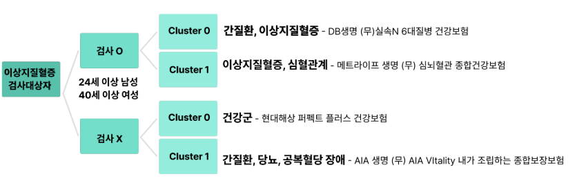
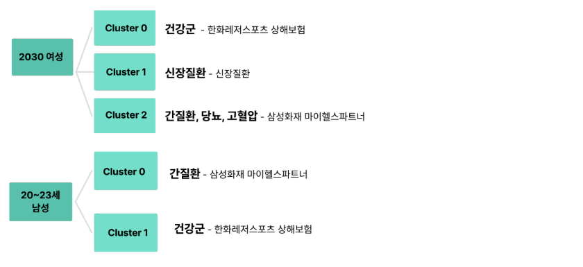

# 🩺 건강검진 데이터 기반 맞춤형 보험 추천 (건강 MBTI)

* **프로젝트 기간** : 2025/04/15 \~ 2025/04/25 (10일)
* **목적** : 건강검진 데이터를 활용한 맞춤형 보험 추천 서비스 기획
* **핵심 기능** : 군집분석 기반 건강 페르소나 생성 → 페르소나별 맞춤형 보험 매칭
* **주요 기법** : 군집분석 (KMeans), 차원축소 (PCA)

---
## 📑 목차
- [1. 프로젝트 개요](#1-프로젝트-개요)
  - [1-1. 기획 배경](#1-1-기획-배경)
  - [1-2. 시장 조사](#1-2-시장-조사)
  - [1-3. 문제 상황](#1-3-문제-상황)
  - [1-4. 프로젝트 목적](#1-4-프로젝트-목적)
  - [1-5. 활용 기술](#1-5-활용-기술)
  - [1-6. 개인 기여 (전은진)](#1-6-개인-기여-전은진)
- [2. 결과](#2-결과)
  - [2-1. 군집분석 결과](#2-1-군집분석-결과)
  - [2-2. 고객 이탈/비이탈 분석](#2-2-고객-이탈비이탈-분석)
- [3. 이슈사항](#3-이슈사항)
  - [3-1. 데이터 한계](#3-1-데이터-한계)
  - [3-2. 군집분석 성능 한계](#3-2-군집분석-성능-한계)
- [4. 데이터 설명](#4-데이터-설명)
  - [4-1. 원천 데이터 컬럼 및 결측치 처리 방법](#4-1-원천-데이터-컬럼-및-결측치-처리-방법)
  - [4-2. 파생 변수 생성](#4-2-파생-변수-생성)
  - [4-3. 질병 판정 기준](#4-3-질병-판정-기준)
- [5. 파일 구조](#5-파일-구조)
- [6. 회고](#6-회고)
- [7. 발표자료&시연영상](#7-발표자료시연영상)
  
  
  ---

## 1. 프로젝트 개요

### 1-1. 기획 배경

* 건강에 대한 사회적 관심 지속적 증가
* 국민건강보험공단·질병관리청 등 공공기관에서 **빅데이터 기반 질병 대응 연구** 활발히 진행

### 1-2. 시장 조사

* **최근 금융앱 동향** : 단순 자산관리 → 헬스케어 서비스 확장

  * **우리은행 × GC케어** : 문진 기반 건강 나이·질병 위험도·피부 나이 산출 → 건강관리 가이드 제공
  * **KB라이프** : 건강정보 분석 + 영양제 분석·비급여 병원비 비교 서비스 제공
  * **DB생명** : 건강 나이·질환 등급 시각화, 암·질환 예측, 맞춤형 영양 성분 추천 및 병원비 비교 기능 제공

### 1-3. 문제 상황

* **iM뱅크 헬스케어 서비스의 한계**

  * iM샵 플랫폼을 통한 **생체 나이 분석 서비스** 제공 중
  * 비만·간·심장·췌장·신장 기능을 나이로 환산해 종합 분석 → 직관적 이해 가능
  * 그러나 **단순 조회 서비스에 그침**, 금융 서비스와의 연계 부족

### 1-4. 프로젝트 목적

* 건강검진 데이터를 군집분석하여 **MBTI 형식의 건강 페르소나** 제공

  * 예: "건강한 연기 중독러", "간 건강 취약형" 등
* 카드 데이터와 연계해 **생활·소비 패턴 기반 맞춤 보험** 추천
* 비급여 병원비 조회 서비스와 연결 → 실질적 의료비 절감 기여

### 1-5. 활용 기술

* **언어** : Python
* **알고리즘** : KMeans, PCA

### 1-6. 개인 기여 (전은진)

* 은행 개인 고객 데이터 전처리
* 건강검진 데이터 군집분석 수행
* 발표 및 스토리라인 구성

---

## 2. 결과

### 2-1. 군집분석 결과

* 건강검진 데이터 기반 **군집분석 페르소나 도출**
  
  

### 2-2. 고객 이탈/비이탈 분석

* **이탈 집단**은 비이탈 집단보다 의료·보험 지출이 많음
* 건강 서비스·보험 제공 시 **이탈 방지 효과** 기대

---

## 3. 이슈사항

### 3-1. 데이터 한계

* 초기 기획: 건강검진 데이터 + 개인 질병 데이터 연계 → 보험 추천
* 실제 데이터는 **마스킹**으로 인해 병합 불가
* 연구용 데이터 요청 시 소요 기간(1개월 이상) 문제 → 제한된 프로젝트 기간 내 수행 불가
* 결과적으로 **군집분석 결과만 활용**할 수밖에 없었음

### 3-2. 군집분석 성능 한계

* 목표: 실루엣 계수 ≥ 0.4
* 초기 결과는 낮게 산출 → 성별 기준으로 데이터 분할 후 재분석
* 성별에 따라 건강 상태 차이가 커서 분리 시 성능 향상 확인

---

## 4. 데이터 설명

### 4-1. 원천 데이터 컬럼 및 결측치 처리 방법

| 컬럼명        | 결측치율    | 처리방법    | 비고        |
| ---------- | ------- | ------- | --------- |
| 허리둘레       | 0.041%  | 인스턴스 제거 |           |
| 시력(좌)      | 0.018%  | 인스턴스 제거 |           |
| 시력(우)      | 0.18%   | 인스턴스 제거 |           |
| 청력(좌)      | 0.014%  | 인스턴스 제거 |           |
| 청력(우)      | 0.014%  | 인스턴스 제거 |           |
| 감마지피티      | 0.588%  | 인스턴스 제거 | 간기능 지표    |
| 혈청지피티(ALT) | 0.589%  | 인스턴스 제거 | 간기능 지표    |
| 수축기혈압      | 0.575%  | 인스턴스 제거 | 고혈압 지표    |
| 이완기혈압      | 0.578%  | 인스턴스 제거 | 고혈압 지표    |
| 식전혈당(공복혈당) | 0.585%  | 인스턴스 제거 | 당뇨 지표     |
| 혈색소        | 0.586%  | 인스턴스 제거 | 빈혈 지표     |
| 요단백        | 1.123%  | 인스턴스 제거 | 신장질환 지표   |
| 혈청크레아티닌    | 0.590%  | 인스턴스 제거 | 신장질환 지표   |
| 혈청지오티(AST) | 0.589%  | 인스턴스 제거 | 간기능 지표    |
| 총콜레스테롤     | 66.139% | 인스턴스 제거 | 이상지질혈증 지표 |
| 트리글리세라이드   | 66.139% | 인스턴스 제거 | 이상지질혈증 지표 |
| HDL콜레스테롤   | 66.139% | 인스턴스 제거 | 이상지질혈증 지표 |
| LDL콜레스테롤   | 66.139% | 인스턴스 제거 | 이상지질혈증 지표 |
| 치석         | 65.315% | 인스턴스 제거 | 구강검사 지표   |

### 4-2. 파생 변수 생성

| 기존컬럼명        | 새로운 변수명 | 생성식/예시                                      | 비고       |
| ------------ | ------- | ------------------------------------------- | -------- |
| 키, 체중        | BMI     | 체중 / (키²)                                   | 질병관리청 기준 |
| 혈청크레아티닌, 연령대 | 사구체여과율  | 186 × (혈청크레아티닌^−1.154) × (연령^−0.203) × 성별계수 | 신장기능 지표  |
| 시력(좌), 시력(우) | 평균시력    | (시력(좌) + 시력(우)) / 2                         | 시력 대표값   |

---

### 4-3. 질병 판정 기준

### (1) 신장질환

* **판단 기준 변수** : 사구체여과율
* **수치 기준/조건** :

  * ≥90 → 정상
  * 60\~89 → 신장기능 초기 저하
  * 30\~59 → 신장기능 중등도 저하
  * 15\~29 → 신장기능 심각 저하
  * <15 → 신부전
* **판단 결과** : 정상, 이상, 질환 의심

### (2) 간질환

* **판단 기준 변수** : AST, ALT, 감마지피티
* **수치 기준/조건** :

  * AST > 40 또는 ALT > 40 또는 GTP > 63(남), 35(여)
* **판단 결과** : 간기능 이상 의심

### (3) 고혈압

* **판단 기준 변수** : 수축기/이완기 혈압
* **수치 기준/조건** :

  * 수축기 ≥140 또는 이완기 ≥90 → 고혈압 의심
  * 수축기 120~~139 또는 이완기 80~~89 → 고혈압 전단계
  * 수축기 <120, 이완기 <80 → 정상
* **판단 결과** : 정상, 전단계, 의심

### (4) 빈혈

* **판단 기준 변수** : 혈색소
* **수치 기준/조건** :

  * 남 ≥13, 여 ≥12 → 정상
  * 그 미만 → 빈혈 의심

### (5) 당뇨병

* **판단 기준 변수** : 공복혈당
* **수치 기준/조건** :

  * ≥126 → 당뇨병 의심
  * 100\~125 → 공복혈당장애 의심
  * <100 → 정상
* **판단 결과** : 정상, 공복혈당장애, 당뇨 의심

### (6) 이상지질혈증

* **판단 기준 변수** : 총콜레스테롤, HDL, LDL, 트리글리세라이드
* **수치 기준/조건** :

  * 총콜레스테롤 >250 또는 <150
  * HDL >65 또는 <30
  * LDL >170
  * 트리글리세라이드 >135 또는 <30
* **판단 결과** : 이상지질혈증 의심

</details>


---

## 5. 파일 구조

```text
건강검진 데이터 기반 맞춤형 보험 추천 (건강 MBTI)/
 ┣ code/             # EDA & 군집분석 코드
 ┣ data/             # 공개 데이터
 ┣ private_data/     # 비공개 데이터
 ┣ PPT.pdf           # 최종 발표 자료
 ┣ README.md         # 프로젝트 개요
 ┗ demo.mp4          # 시연 영상
```

---

## 6. 회고

* **데이터 제약 속 대안 찾기** : 제한된 데이터 환경에서 발전 가능성을 모색함
* **서비스 연결 고민** : 단순 분석 결과를 넘어 실제 **금융·헬스케어 서비스와 연계 방안** 마련

---

## 7. 발표자료&시연영상
   - 📑 [최종 발표 PPT](https://drive.google.com/file/d/1H2COW8jxAaqs5MaYPEMawZ4JNzRLFt8r/view?usp=sharing)
   - 🎬 [시연영상](https://drive.google.com/file/d/1Tcm_Ir1l6guz088wC92TU5El6iM21QMv/view?usp=sharing)